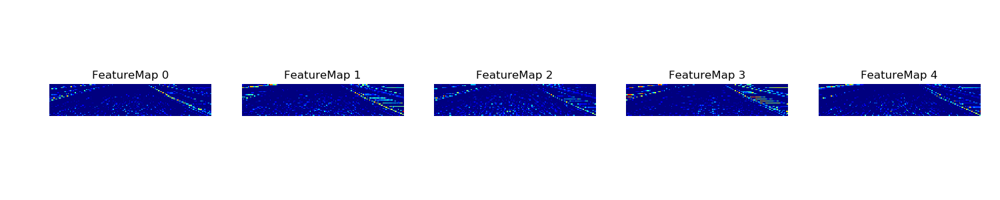
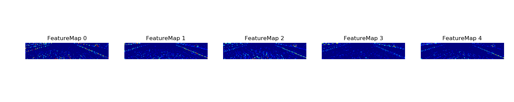

# **Behavioral Cloning** 

## Rubric Points
### Here I will consider the [rubric points](https://review.udacity.com/#!/rubrics/432/view) individually and describe how I addressed each point in my implementation.  

---
### Files Submitted & Code Quality

#### 1. Submission includes all required files and can be used to run the simulator in autonomous mode

My project includes the following files:
* [model.py](model.py) containing the script to create and train the model
* [drive.py](drive.py) for driving the car in autonomous mode. This is the original file, with just the speed increased.
* [model.h5](model.h5) containing a trained convolution neural network 

#### 2. Submission includes functional code
Using the Udacity provided simulator and my drive.py file, the car can be driven autonomously around the track by executing 
```sh
python drive.py model.h5
```

#### 3. Submission code is usable and readable

The [model.py](https://github.com/ivovandongen/CarND-Behavioral-Cloning-P3/blob/master/model.py#L107) file contains the code for training and saving the convolution neural network. The file shows the pipeline I used for training and validating the model, and it contains comments to explain how the code works.

### Model Architecture and Training Strategy

#### 1. An appropriate model architecture has been employed

My model consists of a convolution neural network as descirbed by [NVidia](https://devblogs.nvidia.com/deep-learning-self-driving-cars/), This is captured in [model.py lines 107-124](https://github.com/ivovandongen/CarND-Behavioral-Cloning-P3/blob/master/model.py#L107-L124) 

The model includes RELU layers to introduce non-linearity, and the data is normalized in the model using a Keras lambda layer after being converted to gray scale by another lambda layer.

##### Model layers

```
____________________________________________________________________________________________________
Layer (type)                     Output Shape          Param #     Connected to                     
====================================================================================================
lambda_1 (Lambda)                (None, 160, 320, 1)   0           lambda_input_1[0][0]             
____________________________________________________________________________________________________
lambda_2 (Lambda)                (None, 160, 320, 1)   0           lambda_1[0][0]                   
____________________________________________________________________________________________________
cropping2d_1 (Cropping2D)        (None, 65, 320, 1)    0           lambda_2[0][0]                   
____________________________________________________________________________________________________
convolution2d_1 (Convolution2D)  (None, 31, 158, 24)   624         cropping2d_1[0][0]               
____________________________________________________________________________________________________
convolution2d_2 (Convolution2D)  (None, 14, 77, 36)    21636       convolution2d_1[0][0]            
____________________________________________________________________________________________________
convolution2d_3 (Convolution2D)  (None, 5, 37, 48)     43248       convolution2d_2[0][0]            
____________________________________________________________________________________________________
convolution2d_4 (Convolution2D)  (None, 3, 35, 64)     27712       convolution2d_3[0][0]            
____________________________________________________________________________________________________
convolution2d_5 (Convolution2D)  (None, 1, 33, 64)     36928       convolution2d_4[0][0]            
____________________________________________________________________________________________________
flatten_1 (Flatten)              (None, 2112)          0           convolution2d_5[0][0]            
____________________________________________________________________________________________________
dropout_1 (Dropout)              (None, 2112)          0           flatten_1[0][0]                  
____________________________________________________________________________________________________
dense_1 (Dense)                  (None, 100)           211300      dropout_1[0][0]                  
____________________________________________________________________________________________________
dense_2 (Dense)                  (None, 50)            5050        dense_1[0][0]                    
____________________________________________________________________________________________________
dense_3 (Dense)                  (None, 10)            510         dense_2[0][0]                    
____________________________________________________________________________________________________
dense_4 (Dense)                  (None, 1)             11          dense_3[0][0]                    
====================================================================================================
Total params: 347,019
Trainable params: 347,019
Non-trainable params: 0
____________________________________________________________________________________________________

``` 

#### 2. Attempts to reduce overfitting in the model

To reduce overfitting, first I added dropout to all the fully connected layers. This did not work out well. In the end, a single dropout layer before the first fully connected layer worked out best. 
Similarly, I attempted to use l2 regularization (see [model.py](https://github.com/ivovandongen/CarND-Behavioral-Cloning-P3/blob/651f95107348f3e399f9036ab090879cbee57fc6/model.py#L122) in an earlier revision).
This also did not have the desired effect as the car no longer stayed on track in the simulator. 

In the end, the single dropout layer and enough data ensured the model was generalized enough to handle both tracks without issues. The data was split 60/20/20 to have a good validation and
test set as well. To ensure consistency between runs, I used a seed for the random parts (shuffle and split).

#### 3. Model parameter tuning

The model used an adam optimizer, so the learning rate was not tuned manually (See [model.py line 102](https://github.com/ivovandongen/CarND-Behavioral-Cloning-P3/blob/master/model.py#L102)).
Mean squared error (MSE) was used as the loss function.

Only a few epochs were needed, more than 5 resulted in a degradation of performance on the test track and the training and validation loss would start to go up and down.


#####Loss over 10 epochs:


#### 4. Appropriate training data

Training data was chosen to keep the vehicle driving on the road. I used a combination of center lane driving and recovering from the left and right sides of the road. 

For details about how I created the training data, see the next section. 

### Model Architecture and Training Strategy

#### 1. Solution Design Approach

The overall strategy for deriving a model architecture was to iterate quickly. I started out using just the data provided by Udacity and first trying out a few models. As suggested, I started with the most 
[simple model possible](https://github.com/ivovandongen/CarND-Behavioral-Cloning-P3/blob/master/train_simple_model.py#L55) to ensure that everything worked end-to-end. After that I tried the 
[LeNet architecture](https://github.com/ivovandongen/CarND-Behavioral-Cloning-P3/blob/master/train_lenet_model.py#L82), which left as-is, besides adding a lambda layer for normalization and changing the in and output.
On this model, I also added the left and right camera angles to better see how the model would perform. After that, I tuned the model a bit, added dropout layers, but the driving behavior did not improve
much on the simulator.

After the LeNet model, I went over to the NVidia model as suggested. This immediately showed a huge improvement. With this model, track 1 could be completed pretty well. See [this video](examples/track1-video-initial.mp4). 
It failed before the first corner on track 2 though. 

In order to gauge how well the model was working, I split my image and steering angle data into a training and validation set. The difference in loss and accuracy between them was not too big, but adding
a dropout layer before the first fully connected layer did improve the handling on the second track as well, indicating it was generalizing better.

To improve handling of the second track, I recorded a run on that track. This alone was not enough to complete both tracks without incident, so I also added recovery tracks for both. Adding data points
for specific sections that were problematic along the way.

At the end of the process, the vehicle is able to drive autonomously around the track without leaving the road.

#### 2. Final Model Architecture

The final model architecture ([model.py lines 107-124](https://github.com/ivovandongen/CarND-Behavioral-Cloning-P3/blob/master/model.py#L107-L124)) consisted of a convolution neural network with 5 convolutional layers and 4 fully
connected layers. This is preceeded by two lambda layers and a cropping layer to pre-process the input.

Here is a visualization of the architecture


#### 3. Creation of the Training Set & Training Process

To capture good driving behavior, I took the provided data on track one using center lane driving and added a similar data set for track 2. Here is an example image of center lane driving:


I then recorded the vehicle recovering from the left side and right sides of the road back to center so that the vehicle would learn to recover when it reaches a bad position on the road.
These images show what a recovery looks like starting from a bad position on the left side of the track:


Then I repeated this process on track two in order to get more data points, especially on sections of the track where the road edges or surface texture changed and for all notable corners.

To augment the data sat, I also flipped images and angles thinking that this would lead to a better balanced dataset as, especially track 1, includes mostly corners in the same direction.
For example, here is an image that has then been flipped:


After the collection process, I had `14921` number of data points, `44763` including the left and right camera angles, 
`59684` including the flipped center images 

I randomly shuffled the data set and put 20% of the data into a validation set and 20% in the test set. I used a seed for the
shuffle and split operations to make it consistent between iterations. Finally, there were `35808` samples in the training set
`11936` in the validation set and `11940` in the test set.

I used this training data for training the model. The validation set helped determine if the model was over or under fitting. The ideal number of epochs was 4-5 as after that the 
loss didn't decrease further and and would start occillating. I used an adam optimizer so that manually training the learning rate wasn't necessary.

I preprocessed each image by first converting it to grayscale, then normalizing and finally clipping them (to show only the relevant part containing the road) 
as part of the model. Doing this as part of the model is quite convenient as you don't have to make sure the same operations are done when using the model after training.

#### Visualization of first convolutional layer

To get a better sense of what the model "sees", I included visualizations of a couple filters in the first convolutional layer. 
As you can see, in track 1 the road edges show up quite clearly and in track 2 it also shows the center line. 

I used the code in [model.py lines 218 - 235](https://github.com/ivovandongen/CarND-Behavioral-Cloning-P3/blob/master/model.py#L218-L235)
to create the visualizations.

#### Track 1







#### Track 3


#### Video results

##### Track 1 on sample data
[](http://www.youtube.com/watch?v=2tk5wp1-zDc)

##### Track 1 on final model
[](http://www.youtube.com/watch?v=)

##### Track 2 on final model
[](http://www.youtube.com/watch?v=yl-srZHqV78)